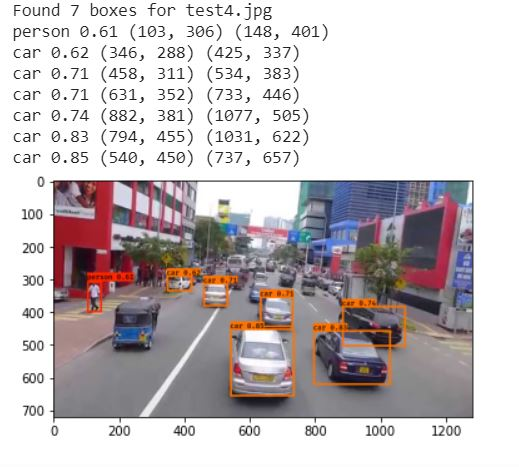

# Car-Detection-with-YOLO
Model to detect cars, buses and other objects relevant to driving. It can take images as input and gives the output framing the objects which can be used for autonomous driving. (Using YOLO model - Transfer Learning))

The file yolo.h5 is needed which is quite large so it is needed to be downloaded online. Please download [yolo.h5](https://www.kaggle.com/rmoharir8396/notebook) and add it to the folder image_data.

## Model

If we have 80 classes that we want the object detector to recognize, we can represent the class label  cc  either as an integer from 1 to 80, or as an 80-dimensional vector (with 80 numbers) one component of which is 1 and the rest of which are 0. In OD.ipynb we will use both representations, depending on which is more convenient for a particular step.

In this model, we have used "You Only Look Once" (YOLO) performs object detection, and then apply it to car detection. Because the YOLO model is very computationally expensive to train, we have loaded pre-trained weights.

## Input

The input is a batch of images, and each image has the shape (m, 608, 608, 3). We can add a video and then take snaps to use the model.

## Output

The output is a list of bounding boxes along with the recognized classes. 

#### Output snaps

## Model Summary

Total params: 50,983,561

Trainable params: 50,962,889

Non-trainable params: 20,672
_____________________________

## Instructions

1. Install yolo.h5 file from the source given in the readme file to use the model.
2. You put this file in the model_data folder in the project.
3. To use the model Run OD.IPYNB file in jupyter notebook.
4. You can test different images in the Images folder to see the output.

This is a basic model and is made with transfer learning using coco dataset for object detection.

## References

The model has been made by taking reference from [this](https://www.coursera.org/learn/convolutional-neural-networks/notebook/bbBOL/car-detection-with-yolo) course. 

Also, it has used YOLO model for object detection.
- Joseph Redmon, Santosh Divvala, Ross Girshick, Ali Farhadi - You Only Look Once: Unified, Real-Time Object Detection (2015)
- Joseph Redmon, Ali Farhadi - YOLO9000: Better, Faster, Stronger (2016)
- Allan Zelener - YAD2K: Yet Another Darknet 2 Keras
- The official YOLO website (https://pjreddie.com/darknet/yolo/)

